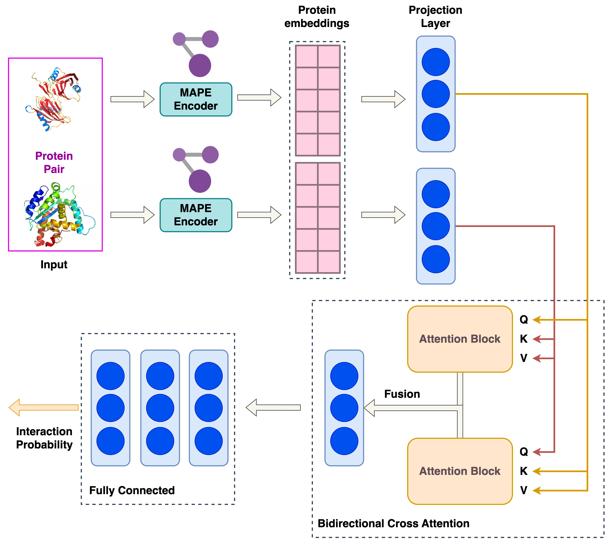

# Structure-Based Deep Learning Framework for Modeling Human-Gut Bacterial Protein Interactions



```bash
git clone https://github.com/LirongWu/MAPE-PPI
```

```bash
rye run manage embedder generate
```

