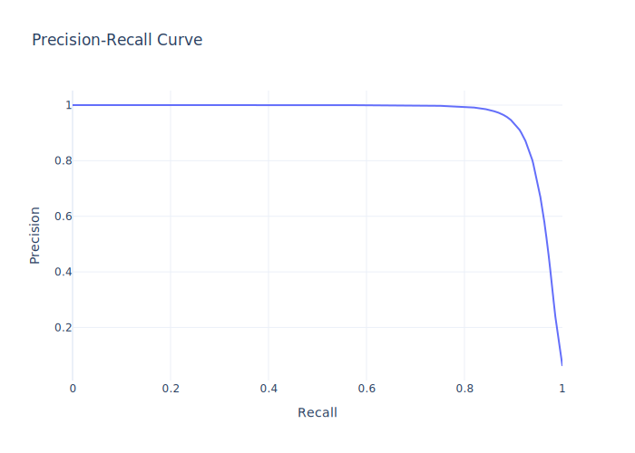
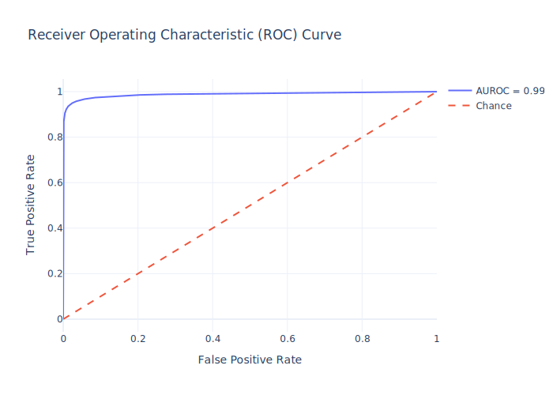

# Structure-Based Deep Learning Framework for Modeling Human-Gut Bacterial Protein Interactions

## Description

**Background:** The interaction network between human host proteins and the proteins of the gut bacteria is crucial for maintaining human health.  Its dysregulation is directly linked to the development of various diseases.  Despite its importance, experimental data on protein-protein interactions (PPIs) between these species are limited due to experimental challenges.

**Methods:** This study presents a deep learning-based framework for predicting PPIs between human and gut bacterial proteins using structural data. The framework employs graph-based protein representations and variational autoencoders (VAEs) to extract structural embeddings from protein graphs. These embeddings are then fused using a Bi-directional Cross-Attention module to predict interactions.  The model addresses the common issue of class imbalance in PPI datasets by utilizing focal loss, which gives more weight to harder-to-classify samples.


**Results:** The framework demonstrates robust performance, achieving high precision and recall on both validation and test datasets. This highlights the model's ability to generalize well to unseen data.  By incorporating proteoforms (protein variants arising from a single gene), the model accounts for the inherent structural complexity within proteomes, leading to more biologically relevant predictions.






**Conclusions:** This framework provides a scalable tool for investigating the complex interplay between the human host and the gut microbiota. The findings have the potential to reveal novel treatment targets and diagnostics for disorders associated with the microbiome.

## How to Run

This section outlines the steps to use the framework, from data preparation to model training, evaluation, and inference on new data.

### 1. Environment Setup (using `rye`)

This project uses `rye` for dependency management and task running. Install `rye` following the instructions on the [official rye documentation](https://rye-up.com/).  Once `rye` is installed, initialize the project environment:

```bash
rye sync
```

### 2. Data Preparation

The data preparation follows the guidelines of the [MAPE-PPI](https://github.com/LirongWu/MAPE-PPI) project.  Refer to the [Data Module](./src/struct_ppi_pred/data) documentation and the MAPE-PPI repository for detailed information.

Your data directory (placed under the `data` folder at the project root) should have the following structure:

```
data/
├── train.csv          # Training split file
├── val.csv            # Validation split file
├── test.csv           # Test split file
├── processed_data/    # Preprocessed feature files
│   ├── <UniProtID>_r_contacts.npy  # Residue contact map
│   ├── <UniProtID>_k_contacts.npy  # k-NN contact map
│   └── <UniProtID>_nodes.pt        # Node features
```

*   `<UniProtID>` should be replaced with the actual UniProt ID of each protein.
*   The `_r_contacts.npy` and `_k_contacts.npy` files represent the contact maps.
*   The `_nodes.pt` file contains the node features for the protein graph.

### 3. Embedding Extraction

Before training or inference, you need to extract embeddings for all proteins using the pre-trained VAE model from MAPE-PPI.

**Step 1: Obtain MAPE-PPI (Optional, but Recommended)**
Although not strictly required if you already have a pre-trained VAE checkpoint, it's helpful to have the MAPE-PPI repository for reference:
```bash
git clone https://github.com/LirongWu/MAPE-PPI
```
**Step 2: Generate Embeddings**

Use the following command to generate embeddings:

```bash
rye run task embed dev --mape-weights-path /path/to/vae_model.ckpt
```

*   Replace `/path/to/vae_model.ckpt` with the actual path to your pre-trained VAE checkpoint file.  You may need to obtain this checkpoint from the MAPE-PPI authors or train your own VAE using their code.
*  This command will create a `<UniProtID>_embedding.pt` file for each protein in the `processed_data` directory.

### 4. Model Training

To train the protein-protein interaction prediction model, use the following command:

```bash
rye run task train
```

The best-performing model (based on validation set performance) will be saved in the automatically generated `output` directory at the project root. Training progress, including metrics on the validation set, will be logged.

### 5. Model Evaluation

#### 5.1 Validation Set Evaluation and Threshold Selection

To evaluate the model on the validation set and determine the optimal decision threshold, run:

```bash
rye run task performance val
```

This command will:

*   Calculate various performance metrics (precision, recall, F1-score, AUROC, AUPRC, etc.) on the validation set.
*   Determine the decision threshold that maximizes the F1-score.
*   Save a precision-recall curve plot (`val_pr_curve_thres.svg`) showing the selected threshold in the `output` directory.
*   Log all metrics.

#### 5.2 Test Set Evaluation

To evaluate the model on the test set using the optimal threshold determined from the validation set, use:

```bash
rye run task performance test --threshold <threshold_value>
```

*   Replace `<threshold_value>` with the optimal threshold obtained from the validation set evaluation (e.g., `0.4046`, as shown in the results).

This command will:
* Calculate performance metrics on the test set.
* Save the following files to the output directory:
    * `confusion_matrix.csv`: A CSV file containing the confusion matrix.
    * `pr_curve.svg`: The precision-recall curve.
    * `roc_curve.svg`: The ROC curve.
* Log all metrics.

### 6. Inference on New Data

To predict interactions between two new sets of proteins (pool A and pool B), follow these steps:

#### 6.1 Data Preparation (Inference)

Create a directory (e.g., `gut_data`) with the following structure:

```
gut_data/
├── processed_data/    # Preprocessed feature files for *all* proteins in *both* pools
│   ├── <UniProtID>_r_contacts.npy
│   ├── <UniProtID>_k_contacts.npy
│   └── <UniProtID>_nodes.pt
└── pairs.json         # JSON file defining the two protein pools
```

The `pairs.json` file should have the following format:

```json
{
    "Pool_A": ["UNIPROT-ID_1", "UNIPROT-ID_2", ... ],
    "Pool_B": ["UNIPROT-ID_3", "UNIPROT-ID_4", ... ]
}
```

*   Replace `"UNIPROT-ID_1"`, `"UNIPROT-ID_2"`, etc., with the actual UniProt IDs of the proteins.
* The model will predict all possible interactions between proteins in `Pool_A` and `Pool_B`.

#### 6.2 Embedding Extraction (Inference)

Generate embeddings for the proteins in *both* pools using the pre-trained VAE:

```bash
rye run task embed inf --data-path /path/to/your/gut_data --mape-weights-path /path/to/vae_model.ckpt
```

*   `--data-path`:  Specify the path to your inference data directory (e.g., `gut_data`).
*   `--mape-weights-path`: Provide the path to the pre-trained VAE checkpoint.
*   This will create `UNIPROT-ID_embedding.pt` files in the `processed_data` subdirectory.

#### 6.3 Run Inference

Execute the following command to perform the inference:

```bash
rye run task inference --data-path /path/to/your/gut_data --human-uniprot-fts-dir /path/to/human/uniprot/features --bac-uniprot-fts-dir /path/to/bacterial/uniprot/features --pred-dir <prediction_directory_name> --threshold <threshold_value>
```

*   `--data-path`: The path to your inference data directory (e.g., `gut_data`).
*   `--human-uniprot-fts-dir`: The directory containing JSON files with human protein features from UniProt (one `UNIPROT-ID.json` file per protein).
*   `--bac-uniprot-fts-dir`:  The directory containing JSON files with bacterial protein features from UniProt (one `UNIPROT-ID.json` file per protein).
*   `--pred-dir`: The name of the subdirectory within the `output` directory where the inference results will be saved (e.g., `Healthy_Bac`).  This directory will be created if it doesn't exist.
*   `--threshold`: The decision threshold for classifying interactions (use the optimal threshold determined during validation).

The inference results will be stored in the specified prediction directory (`output/<prediction_directory_name>`).  This directory will contain:

*   **`PerProtein/`:** A subdirectory containing individual JSON files for each protein in Pool A (named `<protein_id>_predictions.json`). Each file lists the predicted interactors from Pool B and their corresponding interaction scores.
*    **`net.txt`:**  A text file containing all predicted interactions in a tab-separated format:  `protein_A_id \t protein_B_id \t interaction_score`.  This file provides an aggregated view of the interaction network.